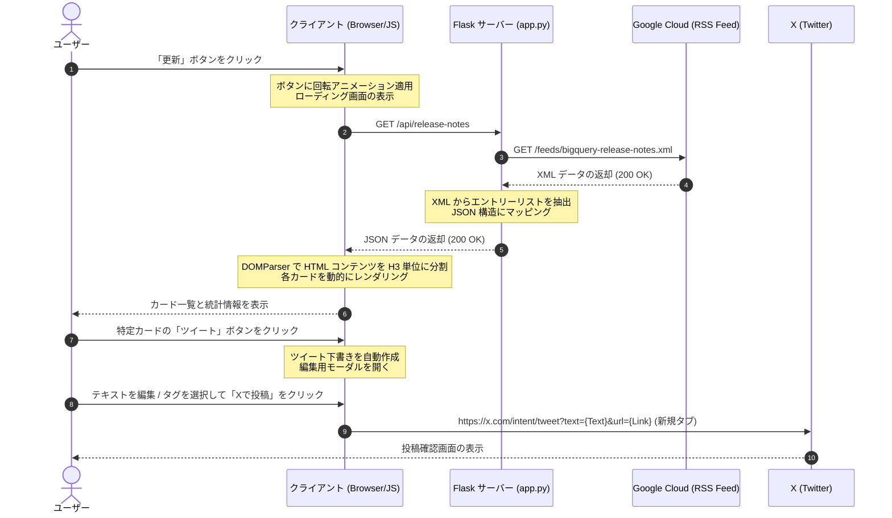

# BigQuery リースノート ハブ - プロジェクト仕様書

このドキュメントは、Python Flask と Vanilla HTML/JavaScript/CSS で構築された「BigQuery リリースノート ハブ」プロジェクトの機能、アーキテクチャ、およびリクエスト・レスポンスの仕組みについて説明します。

---

## 1. 主な機能 (Key Features)

* **リリースノートの動的取得**: Google Cloud が提供する公式の BigQuery リリースノート XML フィードを自動的に取得し、常に最新の情報をダッシュボードに反映します。
* **H3 タグ単位の高度なパース**: 1日分の複数のアップデートが混在する XML エントリーを、クライアントサイドで `H3` タグ（Feature, Change, Deprecated, Issue など）ごとにパース・分割し、独立したカードとして整理します。
* **スマート・フィルタリング**: アップデートの種類（新機能、変更点、非推奨、既知の問題など）をプルダウンメニューから選択し、瞬時に表示を切り替えることができます。
* **ツイートプレビュー・編集モーダル**:
  * アップデートごとに専用の下書きテキストを自動生成。
  * ガラスモーフィズム（Glassmorphism）を取り入れた洗練されたモーダル画面でプレビューおよび直接編集が可能。
  * X (旧Twitter) の仕様に準拠した文字数（280文字制限）カウンターによるリアルタイムバリデーション。
  * よく使われるハッシュタグ（`#BigQuery`、`#GoogleCloud` など）をワンクリックで追加・削除。

---

## 2. システム構成 (Architecture)

本システムは、サーバーサイド（Flask）とクライアントサイド（Vanilla Web）で明確に役割が分離されています。

### 2.1 サーバーサイド (Server-Side: Python Flask)
* **主な役割**: データの仲介（プロキシ）、HTML/静的ファイルの配信。
* **主要コンポーネント**: `app.py`
* **機能詳細**:
  * **ルーティング**: 
    * `/`: メインページ（`index.html`）をレンダリングして返します。
    * `/api/release-notes`: クライアントからのデータ要求をトリガーに、外部の RSS フィードを取得する API エンドポイント。
  * **フィード取得と CORS 回避**: クライアントが外部の Google Cloud RSS フィードに直接アクセスすると発生する CORS 制限を避けるため、サーバーサイドの `urllib.request` で XML をダウンロードし、仲介します。
  * **XML パース**: `xml.etree.ElementTree` を使用して Atom フィード形式の XML をパースし、タイトル、更新日時、リンク、および HTML コンテンツを格納したクリーンな JSON データを生成します。

### 2.2 クライアントサイド (Client-Side: HTML, CSS, JavaScript)
* **主な役割**: データの可視化、コンテンツの再構築、ユーザーインターフェースの制御。
* **主要コンポーネント**: `index.html`、`style.css`、`app.js`
* **機能詳細**:
  * **ビジュアル (CSS)**: CSS カスタムプロパティを使用したダークテーマ、グローオーブ (Glow Orbs)、Glassmorphism 効果によるプレミアムなユーザーインターフェースの提供。
  * **DOM パース (JS)**: ブラウザ組み込みの `DOMParser` を使い、サーバーから受け取った `content` 内の HTML 文字列から `H3` タグを基準に要素を分割。
  * **状態管理**: 読み込み中 (Loading)、エラー (Error)、データ無し (Empty)、コンテンツ表示 (Content) の各状態に応じて、画面描画を動的に切り替えます。
  * **インタラクション**: 各ボタンのイベントハンドリング、モーダルのアニメーション開閉、文字数超過時の投稿ボタンの無効化処理など。

---

## 3. リクエストとレスポンスのサンプルフロー

ユーザーがアプリを開き、「更新」ボタンを押して最新のリリースノートを確認し、ツイートするまでの一連のフローです。

### 詳細フロー解説

1. **ユーザー操作**: ユーザーが「更新」ボタンをクリックします。
2. **APIリクエスト**: `app.js` の `fetchReleaseNotes()` が呼び出され、バックエンドの `/api/release-notes` に対して非同期通信 (`fetch`) が発生します。この時、画面にはスピナーが表示されます。
3. **外部通信**: `app.py` は、Google Cloud が提供する `bigquery-release-notes.xml` を `urllib` でダウンロードします。
4. **外部レスポンス**: Google Cloud から XML フィードが返却されます。
5. **JSON生成**: `app.py` は XML 内の各 `<entry>` を処理し、`title` (日付), `updated`, `link`, `content` (HTML文字列) を含む JSON オブジェクトのリストを生成してクライアントに返します。
6. **動的パースとレンダリング**: 
   * `app.js` は受信した各エントリーの `content` 内の HTML を `DOMParser` を使ってパースします。
   * 例えば `<h3>Feature</h3>
...
<h3>Change</h3>
...
` というデータの場合、`Feature` と `Change` の2つの独立したアイテムに分割し、それぞれに割り当てられた日付とリンクを付与します。
   * 生成された各アイテムのカテゴリ（Feature、Change等）に応じて、カラーバッジや左端のラインの色を動的に適用し、カードとして画面に描画します。
7. **ツイートモーダルの起動**: 
   * ユーザーが特定のカードの「ツイート」ボタンをクリックすると、`app.js` は `【BigQuery アップデート】[日付] [カテゴリ] [要約テキスト]...` というテンプレートを作成します。
   * ガラスモーフィズム効果を持つモーダルがポップアップし、ユーザーはテキストを自由に微調整できます。文字数超過時は「投稿」ボタンが自動的に無効化され、視覚的に警告されます。
8. **ツイートの実行**: ユーザーが「Xで投稿」をクリックすると、作成した文字列と元のリリースノートのアンカーリンクを含めた URL を作成し、`window.open` を使って新しいタブで X (Twitter) の投稿画面を開きます。
